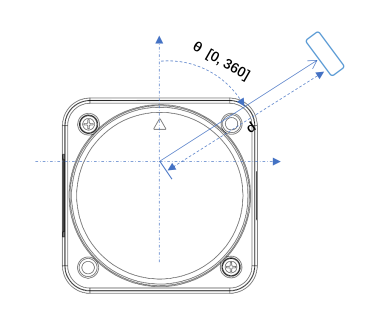

# Teensy-LiDAR
TeensyやESP32でLD06 LiDARを動かします。 ~~(車輪の再発明)~~  
他のマイコンで動かす場合はコンストラクタのSerialをうまいこと設定してください。

最低でも8kBほどメモリを使います。

# 開発環境
* PlatformIO
* Teensy4.1
* M5Stack Atom S3

# 使い方
* `struct LiDAR::point`  
     直交座標 
    * `double x` / mm  
    * `double y` / mm 
 
     極座標
    * `double r`: 半径 / mm  
    * `double theta`: LiDARの印を原点とし、反時計回り正。0°≦θ≦360°  
    * `confidence` 数字が大きいほど良き

* `LiDAR::LD06::LD06(HardwareSerial& ser = Serial1)`  
    Teensyduinoの場合はこれが適用される
* `LiDAR::LD06::LD06(const uint8_t rx, HardwareSerial& ser = Serial1)`  
    Teensyduino以外、ESP32を想定
* `void LiDAR::LD06::init()`  
    シリアルの初期化
* `std::vector<LiDAR::point> LiDAR::LD06::read(bool waitToRead = false , bool readAll = true)`   
    指定分読む  
    * `bool waitToRead` パケットが来ていないときは待つ  
    * `bool readAll` 複数パケットが来ているときは全て読む

# 座標系
>   
> https://storage.googleapis.com/mauser-public-images/prod_description_document/2021/315/8fcea7f5d479f4f4b71316d80b77ff45_096-6212_a.pdf
* θ: 上図の通り
* X軸: 上図右方向
* Y軸: 上図上方向

# 参考
1. [LD06 Development manual](https://storage.googleapis.com/mauser-public-images/prod_description_document/2021/315/8fcea7f5d479f4f4b71316d80b77ff45_096-6212_a.pdf)
2. [TanoRobo](https://github.com/TanoRoboRCJ/Software/blob/feature/%2316_RAICHO/Firmware/F446-LiDAR/)
